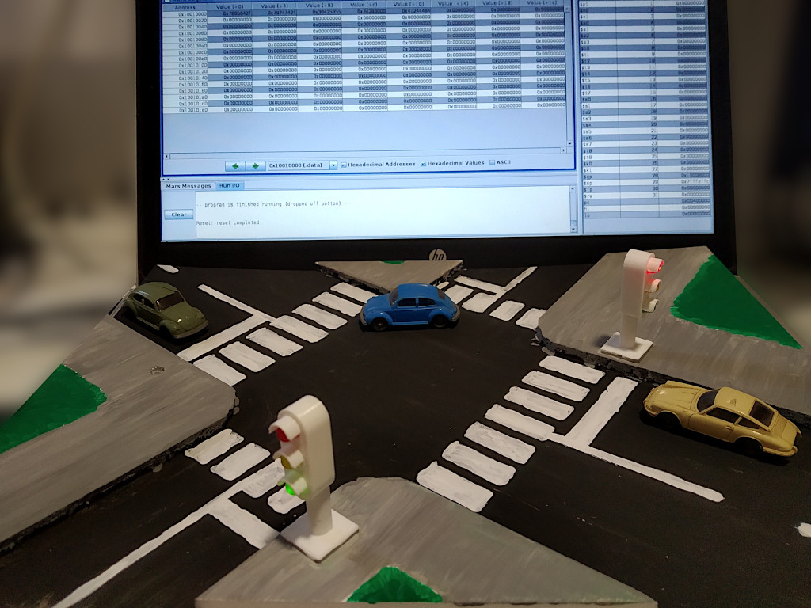
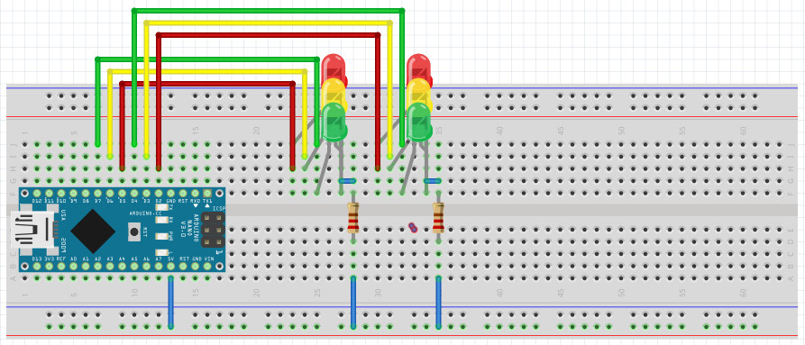

 
 
 
 
Using MARS MIPS simnulator, to access some port of the host system, use the appropriate SYSCALL from the following examples: 
 
- fopen(): 
	li	$v0, 13 
	la	$a0, "/dev/ttyUSB0"	# path to the file corresponding to the serial port 
	li	$a1, 1			# Read: $a1=0, Write: $a1=1 
	li	$a2, 0 
	syscall 
	move	$t0, $v0		# Saves the file descriptor in register $t0 
 
- fwrite(): 
	li	$v0, 15 
	move	$a0, $t0	# file descriptor is in register $t0 
	la	$a1, buffer	# buffer holds the string to be written 
	li	$a2, N		# N is the number of characters in the string 
	syscall 
 
- fread(): 
  	li	$v0, 14 
	move	$a0, $t0	# file descriptor is in register $t0 
	li	$a1, buffer	# input buffer address in data segment (e.g.: buffer .space 100) 
	syscall 
 
- fclose(): 
	li	$v0, 16 
	move	$a0, $t0	# file descriptor is in register $t0 
	syscall 
 
- delay(): 
	li	$v0, 32 
	li	$a0, 2000	# pause 2000 ms (2 seconds) 
	syscall 
  

